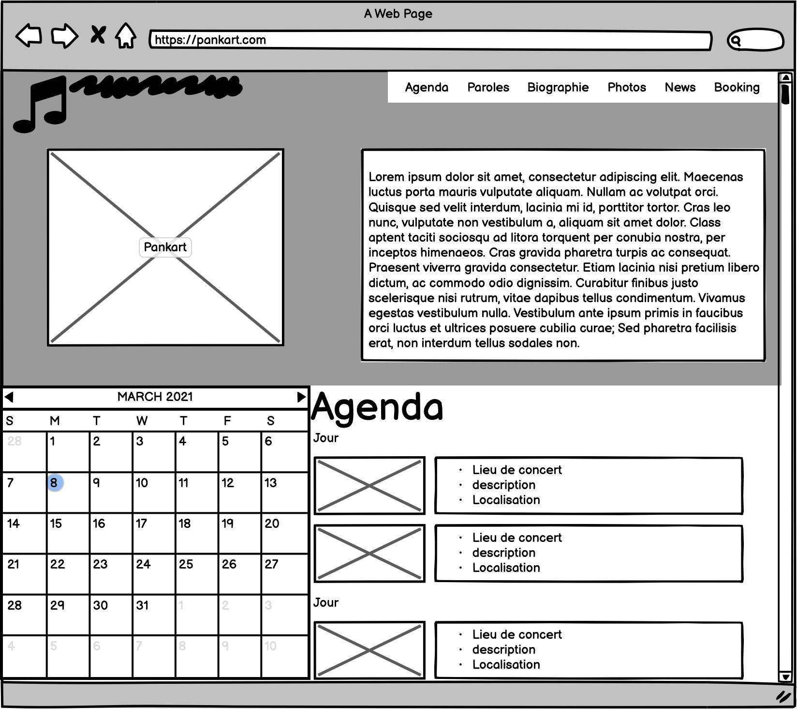
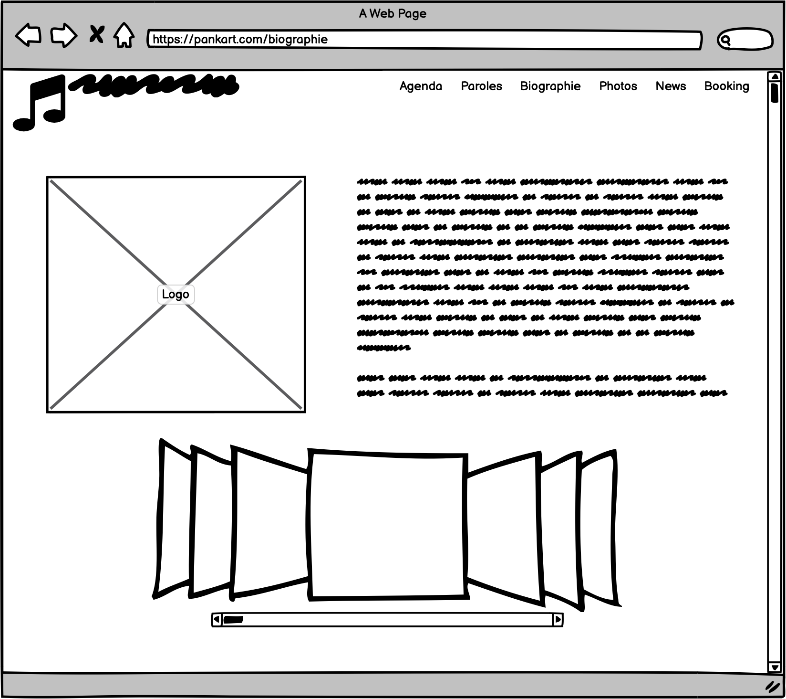
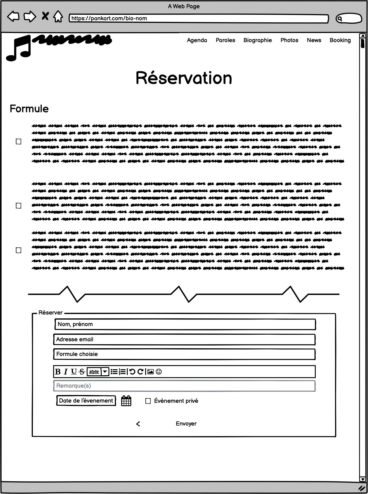
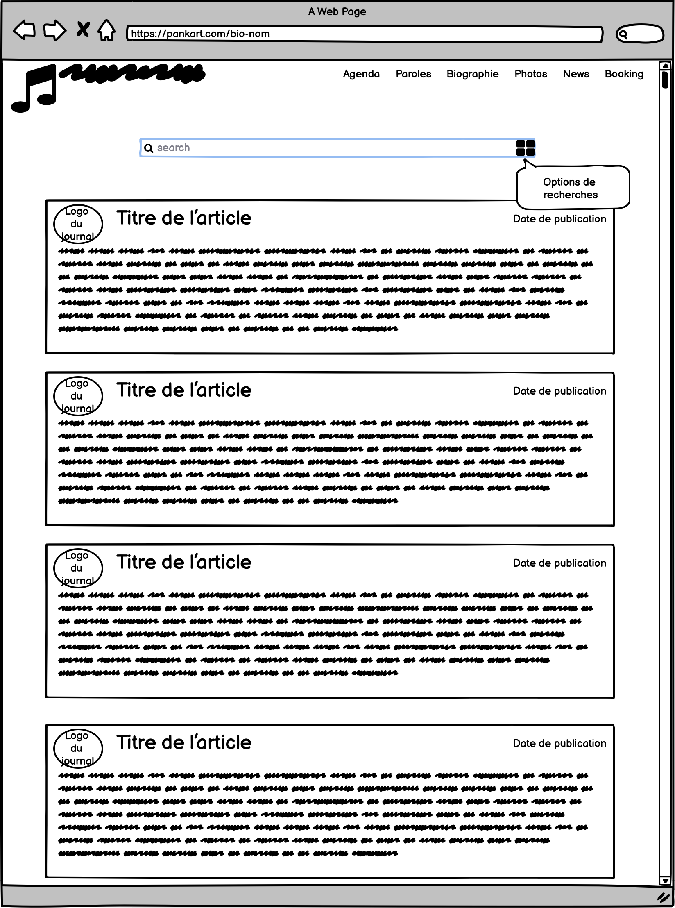
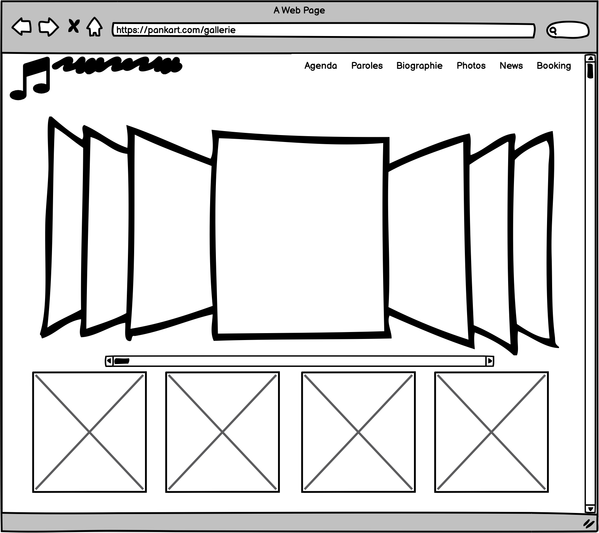

# Pankart

Ce repo a été créé dans le cadre d'un projet de la HEPL. (https://github.com/hepl-dw/projet-pankart)

## Plan de site

### Structure, Plan du site

#### Structure du client

- Des pages dédiées
    - Agenda des concerts
    - Bio
        - du groupe
        - des 6 musicos : une page de présentation pour chacun des membres du - groupe et dont le contenu serait un peu délirant (texte et photos)
    - Galerie
        - Photos
        - Vidéos
    - News pour celle du groupe, mais aussi nos coups de cœur et de gueule
    - Revue de presse
    - Contact et booking
    - Cerise sur le cake : une tête de Mathieu Michel (ou Stéphane Moreau, - bref interchangeable en fonction des « stars » faisant l’actualité) - sur laquelle on peut jouer à lancer des Panꓘart …
    - Sans oublier la Privacy Policy, RGPD oblige

- Liens vers
    - Gigstarter pour le booking
    - Nos réseaux sociaux
    - Streaming
    - Apps

***

#### Plan du site

- Page agenda concert
- Page paroles de leurs chansons
- Bio du groupe
    - Bio chacun des membres
- Gallerie Photos
- Gallerie Videos
- Page News
- Page coups de coeur
- Page coups de gueule
- Page presse (apparision TV, magasines, journeaux, grand titre)
- Merchandising
    - Formulaire de contact pour acheter EP
    - Lien vers Amazon
- Booking
    - Renvoyez vers leur Gigstarter
    - Formaulaire de contact pour réserver
- Page Private Policy

***

## Stratégie

* Objectif

L'objectif traduit par ce site est de se faire connaitre le groupe par le plus grand nombre de personnes et de facilité l'acces au groupe pour un organisateur.

* Page agenda concert

Cette page permettra d'avoir une vue d'ensemble sur l'agenda du groupe, possibilité de trier les dates par lieux, ...

Elle s'organisera comme un agenda calssique, c-a-d avec une liste triée et grouper par date, sous chaque date il y aura l'/les événement(s) lié(s) a cette dernière.

L'événement sera composé d'un titre, d'une description et d'un localisation.

* Page paroles de leurs chansons

Cette page servira à lister premièrement toutes les chansons, avec la possibilité de les écouter.

Quand on cliquera sur la chanson choisie on sera redirigé sur une page avec les paroles pt aussi avec les commentaires du groupes qui expliquera les paroles et peut etre une partie annecdotes sur la musique.

* Bio du groupe

Sur cette page, sera présent la bio du groupe (voir brief). en dessous de ce texte, la photo personnelle de chaque membres du groupe qui redirigera vers la bio personnelle de chaque membres.

     Bio chacun des membres: sur cette page on y retrouvera la description du membre 

* Gallerie Photos

Cette page permettra de présenter les photos choisient par le groupe grâce à un carroussel sur la partie haute de la page. Sur la deuxième partie de la page, il y aura une gallerie photo. Quand on cliquera sur cette dernière il y aura une visualisation en plein écran de l'image choisie.

* Gallerie Videos

Idem photo (pt sur la même page)

* Page News

Cette page présentera les articles de presse qui mettent en avant les actualités du groupe.

* Page coups de coeur

Cette page mettra en avant les articles d'actualités qui ont interpellé le groupe, avec peut-être un petit mot explicatif.

* Page coups de gueule

Cette page mettra en avant les articles d'actualités qui ont interpellé le groupe, avec peut-être un petit mot explicatif.

* Page presse (apparision TV, magasines, journeaux, grand titre)

* Booking

  . Renvoyez vers leur Gigstarter

  . Formaulaire de contact pour réserver

* Page Private Policy

## Moodboard
[Lien vers milanote](https://app.milanote.com/1Ld0e91zxVkL5w?p=2tvGwAqP6nK)

## Wireframe

### Accueil

### Bio

### Bio d'un membre

### Booking

### News

### Gallerie

## Prise de note et briefing

## Prise de notes

Pankart est un groupe de rock celtique engagé.

Le site demandé par le client, doit être une vitrine pour monsieur et madame tout le monde.

Au vu de ses paroles engagées, le groupe trouve important d'avoir la présence d'une page dédiées aux paroles. Cette page permettrait aux utilisateurs de pouvoir s'attarder sur ces dernières afin d'en comprendre le sens et leurs suptilités.

### Questions/réponses

1. Tous publics confondu, quel est l'objectif du site a mettre en avant?

    * Avoir un maximum de dates de concert et montrer qui est et ce que fait le groupe;

    * Les valeurs engagées du groupe sont importantes pour eux.

      Le site doit être suffisamment immersif.

2. Quels sites vous ont-ils inspirés?

    * Hollyopcircus.com

3. Le site a pour objectif d'attirer quel public en premier?

    * L'organisateur: c'est lui qui va amener un public; Il doit avoir facile de contacter le groupe.

4. Le client va nous fournir une banque d'image.

5. Est-ce que les messages qui sont sur les t-shirts son l'identité du groupe? Peut-on les utilisés entre du section?

    * Oui, les messages sont des messages important pour le groupe.

6. Tranche d'age du public cible?

    * dans le public de PANKART, il n'y a pas vraiment de tranche d'age mais la plupart des personnes ont entre 25-35 ans.

7. Approfondir l'éco-conception web

    * Il s'agit d'allier performances et bon fonctionnement du site web.

8. Pensez-vous pouvoir trouver une alternative a google analytics?

    * Dans le groupe il ya déjà eu des débats?
        * La conclusion est qu'ils sont prêt a faire des concessions pour avancer et faire passer des messages.

      Donc si il y a des alternatives, même ça doit être discuter et voir ce que le groupe va en retirer.

9. Par rapport à la banque d'image, avant les sites des groupes étaient incompréhensible, mais maintenant tous les sites se sont "uniformisés". Est-ce qu'il y a un budget pour la photographie? Ou pour acheter des polices?

    * Oui, ils ont un budget si on arrive a prouver l'utilité des éléments.

10. Dans la section "news", doit on rédiger le visiteur sur un autre lien?

    * L'idée de cette section est de partager avec le visiteur des coups de coeur/gueule mais ils n'ont pas l'envie de devenir un site trop engager de ce côté, ils préfèrent rester un groupe de musique.

11. Avez-vous un visuel par rapport a l'EP?

    Oui, le client vas nous le transmettre.

12. Est-ce que l'univers graphique vas être décliné autre part que sur le site?

    La prochaine étape est de sortir un album et de donc d'utilisé cette charte. Sous réserve de droits d'auteur?

    C'est-à-dire que PanKart peut être considéré comme premier client.

13. Dans les pages de présentation, doit-on avoir une page spécifique par musiciens?

    * Non, elles ne doivent pas nécéssairement se détacher du groupe.

14. CMS?

    * Dans le cadre du cours, on développe en Wordpress. Donc il y aura un accès de modification a tous les éléments du site.

15. Serait-il possible sur le site, d'ajouter un formulaire de vente directement sur le site?

    * Oui, il n'y a pas de soucis même si dans le brief cette partie n'est pas précisée.

      Dans le futur, il y a la possibilité de vendre d'autre article.

16. La charte graphique présente peut-être modifiée ou pas du tout.

    La question va être posée au groupe.

17. Pour la page coup de gueule?

    Le format de cette page sera sous forme de "blog", partage d'avis à la façon de twitter, qui allie le visuel du textuel.

<a href="brief.pdf">Brief</a>

